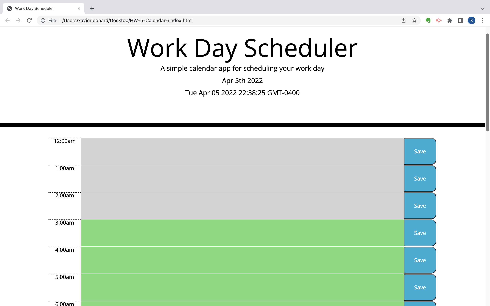

# HW-5-Calendar-

As a new developer, my task was to use jQuery to manipulate DOM and event handlin. I was also tasked with implementing bootstrap and other 3rd party API by creating a simple calendar that allows the user to save events for each hour of the day. I worked with moment.js to work with day and time display at the top of the web app. 

The acceptance criteria was as follows:
- the day is displayed at the top of the calendar
- timeblocks are present when the user scrolls down
- the time block is color coded to indicate whether it is in the past, present, or future
- when clicking on a time block the user can enter an event
- when the user clicks a save button the event is saved and then retrieved from the lcoal storage
- The event remains on the screen when the page is refreshed. 

# proof of functionability

# DeployedURL

https://xleonard1.github.io/HW-5-Calendar-/
https://github.com/xleonard1/HW-5-Calendar-.git